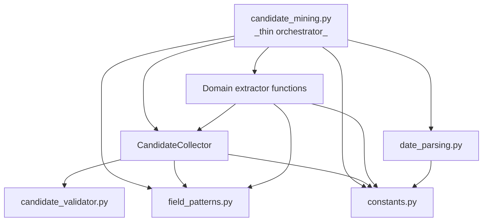

# Plan: ARCH-02 — Decompose `candidate_mining.py`

> **Operational rules:** See [plan-execution-protocol.md](../../03-ops/plan-execution-protocol.md) for agent execution protocol, SCOPE BOUNDARY template, commit conventions, and handoff messages.

**Backlog item:** [arch-02-decompose-candidate-mining.md](../Backlog/arch-02-decompose-candidate-mining.md)
**Branch:** `refactor/arch-02-decompose-candidate-mining`
**PR:** pendiente
**Prerequisite:** `main` actualizado y tests verdes; ARCH-03 (CI complexity gates) recomendado pero no bloqueante
**Worktree:** `C:/Users/ferna/.codex/worktrees/c691/veterinary-medical-records`
**CI Mode:** `2) Pipeline depth-1 gate` (default)
**Agents:** GPT 5.4 (default), Claude Opus 4.6 (high-CC refactors)
**Automation Mode:** `Supervisado`

---

## Agent Instructions

1. **En cuanto termines una tarea, márcala como completada en el plan** (checkbox `[x]` inmediato, sin esperar lote).
2. **Después de completar cada tarea, lanza los tests L1** (`scripts/ci/test-L1.ps1`). Si fallan, repáralos hasta que pasen antes de continuar.
3. **Cuando llegues a una sugerencia de commit, lanza los tests L2** (`scripts/ci/test-L2.ps1`). Si no funcionan, repáralos. Cuando L2 esté verde, espera instrucciones del usuario.
4. **No hagas commit ni push sin aprobación** explícita del usuario.
5. **STOP en commit points.** Al llegar a un commit point, no continúes a la siguiente phase. Espera instrucciones del usuario.
6. **Model routing (hard rule).** Cada step tiene un tag `[Model]`. Al completar un step, comprueba el tag `[Model]` del siguiente step pendiente. Si difiere de tu modelo actual, STOP inmediatamente y di al usuario: _"Next step recommends [Model X]. Switch to that model and say 'continue'."_ NO auto-chains across model boundaries.

---

## Context

`backend/app/application/processing/candidate_mining.py` es el archivo más complejo del codebase:

- **1 097 LOC** en total.
- **`_mine_interpretation_candidates`**: función monolítica de **~770 LOC** (líneas 143-911).
- **CC 163** (cyclomatic complexity más alta del proyecto).
- Inner closure `add_candidate` con **7 bloques de validación** per-field (microchip_id, owner_name, vet_name, clinic_name, clinic_address, owner_address, weight).
- **25+ bloques de extracción** inline organizados por campo: labeled fields, sex, species, breed, clinic header, clinic address blocks, owner address blocks, labeled address parsing, clinic context lines, pet name heuristics, weight heuristics, language inference.
- **40+ regex patterns** compilados a nivel de módulo (líneas 42-140).
- Funciones auxiliares: `_map_candidates_to_global_schema` (L912-944), `_candidate_sort_key` (L946-1097).

Módulos ya factorizados:
- `constants.py` — constantes de configuración y algunos patterns compartidos.
- `date_parsing.py` (~495 LOC) — extractores de fechas, personas, microchips ya delegados.

Tests existentes que importan de `candidate_mining`:
- `test_clinic_name_normalization.py` → `_candidate_sort_key`
- `test_microchip_normalization.py` → `_candidate_sort_key`
- Tests de integración que ejercitan la pipeline completa.

---

## Objective

1. Descomponer `_mine_interpretation_candidates` en funciones/clases especializadas.
2. Extraer la validación per-field a un `CandidateValidator`.
3. Agrupar los 40+ regex en un `FieldPatterns` registry.
4. Que la función orquestadora final sea un coordinador delgado (< 100 LOC).
5. Mantener el API público `_mine_interpretation_candidates()` y `_map_candidates_to_global_schema()` sin cambios.

## Acceptance Criteria (del backlog)

- No function > 100 LOC.
- No function CC > 20.
- All existing tests pass.
- `mine_candidates()` public API unchanged.

## Scope Boundary

- **In scope:** `candidate_mining.py`, nuevo módulo `field_patterns.py`, nuevo módulo `candidate_validator.py`, nuevos extractores por dominio, tests unitarios de regresión para los nuevos módulos.
- **Out of scope:** cambios en `date_parsing.py`, `constants.py`, lógica de `_candidate_sort_key` / `_map_candidates_to_global_schema` (pueden descomponerse en un ticket futuro si exceden umbrales), cambios en frontend/CI/docs canónicos.

---

## Commit Strategy

Esta PR es **backend-only** (refactor de `candidate_mining.py` + nuevos módulos + tests unitarios). No incluye cambios de frontend, CI ni docs canónicas.

| Commit # | After steps | Message | Scope |
|---|---|---|---|
| 1 | P1-A .. P1-B | `refactor(mining): extract CandidateCollector class with validation` | `candidate_mining.py` |
| 2 | P2-A .. P2-G | `refactor(mining): extract per-domain candidate extractor functions` | `candidate_mining.py` |
| 3 | P3-A | `refactor(mining): consolidate regex patterns into FieldPatterns registry` | `candidate_mining.py`, `field_patterns.py` (new) |
| 4 | P4-A .. P4-B | `refactor(mining): slim orchestrator under 100 LOC` | `candidate_mining.py` |
| 5 | P5-A .. P5-B | `test(mining): add unit tests for decomposed extractors` | `test_candidate_collector.py`, `test_field_extractors.py` (new) |
| 6 | P6-A | `refactor(mining): record post-refactor metrics` | Plan file only |

En modo Supervisado, cada commit requiere confirmación explícita del usuario.
Push permanece manual en todos los modos.

---

## Execution Status

**Leyenda**
- 🔄 auto-chain — ejecutable por agente
- 🚧 hard-gate — revisión/decisión de usuario
- `[GPT 5.4]` / `[Claude Opus 4.6]` — modelo asignado

### Phase 0 — Análisis y Diseño

- [x] P0-A 🔄 `[GPT 5.4]` — Ejecutar `radon cc -s -n C backend/app/application/processing/candidate_mining.py` y `radon raw` para obtener métricas baseline (LOC, CC por función). Documentar en este plan sección P0-A Evidence. — `no-commit`
- [x] P0-B 🔄 `[GPT 5.4]` — Crear inventario detallado de los bloques de extracción (nombre lógico, líneas, campo target, tipo: labeled/heuristic/address/identity) dentro de `_mine_interpretation_candidates`. Documentar como tabla en P0-B Evidence. — `no-commit`
- [x] P0-C 🔄 `[GPT 5.4]` — Diseñar la estructura target de módulos y clases: diagrama de dependencias, listado de nuevos archivos, API de cada clase/función. Documentar en P0-C Evidence. — `no-commit`
- [x] P0-D 🚧 — Hard-gate: usuario valida diseño de descomposición antes de implementar. — `no-commit`

### Phase 1 — Extraer `CandidateCollector` (infraestructura)

- [x] P1-A 🔄 `[Claude Opus 4.6]` — Crear clase `CandidateCollector` en `candidate_mining.py` (refactor in-place). Mover `candidates`, `seen_values`, `raw_text`, `lines`, `compact_text` como estado de instancia. Mover `add_candidate` y `add_basic_payloads` como métodos. Mover `_line_index_for_snippet` y `_classify_address_context` como métodos privados. Verificar que `_mine_interpretation_candidates` instancia `CandidateCollector` y delega.
- [x] P1-B 🔄 `[Claude Opus 4.6]` — Extraer la lógica de validación per-field de `add_candidate` a un método `_validate_and_clean(key, value, snippet)` dentro de `CandidateCollector`. Cada campo (microchip_id, owner_name, vet_name, clinic_name, clinic_address, owner_address, weight) es un bloque con guard clause + return.
> 📌 Commit checkpoint — Phase 1 complete. Suggested message: `refactor(mining): extract CandidateCollector class with validation`. Run L2 tests; if red, fix and re-run until green. Then wait for user.

### Phase 2 — Extraer funciones extractoras por dominio

Cada extractor recibe `collector: CandidateCollector` (para llamar `add_candidate`) y `lines: list[str]`. Se crean como funciones de módulo en `candidate_mining.py` de momento (mover a archivos separados se evalúa en P4).

- [x] P2-A 🔄 `[Claude Opus 4.6]` — Extraer `_extract_labeled_field_candidates(collector, lines)`: bloques de diagnosis, medication, procedure, symptoms, vaccinations, lab_result, imaging, line_item (el loop `for line in lines: if ":" in line ...`).
- [x] P2-B 🔄 `[GPT 5.4]` — Extraer `_extract_sex_candidates(collector, lines)`: detección de macho/hembra por contenido de línea y por token normalizado con contexto de ventana.
- [x] P2-C 🔄 `[GPT 5.4]` — Extraer `_extract_species_breed_candidates(collector, lines)`: matching de species_keywords y breed_keywords.
- [x] P2-D 🔄 `[Claude Opus 4.6]` — Extraer `_extract_clinic_candidates(collector, lines)`: clinic_header institucional, clinic_context_line, clinic_standalone_line, clinic_address_block (header scan multi-línea), clinic_address following context.
- [x] P2-E 🔄 `[Claude Opus 4.6]` — Extraer `_extract_owner_address_candidates(collector, lines)`: owner_address_block detection (nombre+dirección adjacentes), owner_address_label_line parsing.
- [x] P2-F 🔄 `[Claude Opus 4.6]` — Extraer `_extract_labeled_address_candidates(collector, lines)`: parsing de CLINIC_ADDRESS_LABEL_LINE_RE, AMBIGUOUS_ADDRESS_LABEL_LINE_RE con context disambiguation.
- [x] P2-G 🔄 `[GPT 5.4]` — Extraer `_extract_pet_name_candidates(collector, lines)`: birthline heuristic + unlabeled title-case heuristic. Extraer `_extract_weight_candidates(collector, lines)`: standalone weight line con contexto temporal. Extraer `_extract_language_candidates(collector, compact_text)`: inferencia heurística de idioma. Verificar suite completa.
> 📌 Commit checkpoint — Phase 2 complete. Suggested message: `refactor(mining): extract per-domain candidate extractor functions`. Run L2 tests; if red, fix and re-run until green. Then wait for user.

### Phase 3 — Consolidar regex en `FieldPatterns` registry

- [x] P3-A 🔄 `[GPT 5.4]` — Crear `backend/app/application/processing/field_patterns.py`. Agrupar los 40+ patterns del módulo `candidate_mining.py` en namespaces lógicos (dataclass o módulo con secciones): `PetNamePatterns`, `ClinicPatterns`, `OwnerPatterns`, `AddressPatterns`, `WeightPatterns`, `FieldLabelPatterns`. Actualizar imports en `candidate_mining.py`.
> 📌 Commit checkpoint — Phase 3 complete. Suggested message: `refactor(mining): consolidate regex patterns into FieldPatterns registry`. Run L2 tests; if red, fix and re-run until green. Then wait for user.

### Phase 4 — Adelgazar orquestador

- [x] P4-A 🔄 `[Claude Opus 4.6]` — Refactorizar `_mine_interpretation_candidates` para que sea un orquestador delgado: instanciar `CandidateCollector`, llamar batch extractors (date_parsing), llamar cada extractor por dominio, retornar `dict(collector.candidates)`. Verificar que la función resultante sea < 100 LOC y CC < 20.
- [x] P4-B 🔄 `[Claude Opus 4.6]` — Si algún extractor excede 100 LOC o CC 20, subdividir hasta cumplir acceptance criteria. Ejecutar test suite completa.
> 📌 Commit checkpoint — Phase 4 complete. Suggested message: `refactor(mining): slim orchestrator under 100 LOC`. Run L2 tests; if red, fix and re-run until green. Then wait for user.

### Phase 5 — Tests unitarios de los nuevos módulos

- [ ] P5-A 🔄 `[GPT 5.4]` — Crear `backend/tests/unit/test_candidate_collector.py`: tests de `CandidateCollector.add_candidate` (dedup, validation per-field, confidence clamping).
- [ ] P5-B 🔄 `[GPT 5.4]` — Crear `backend/tests/unit/test_field_extractors.py`: tests de cada función extractora con fixtures Markdown mínimos que ejerciten el camino happy y un guard case.
> 📌 Commit checkpoint — Phase 5 complete. Suggested message: `test(mining): add unit tests for decomposed extractors`. Run L2 tests; if red, fix and re-run until green. Then wait for user.

### Phase 6 — Validation & Closure

- [ ] P6-A 🔄 `[GPT 5.4]` — Ejecutar `radon cc -s -n C` y `radon raw` post-refactor. Documentar métricas finales en P6-A Evidence. Verificar acceptance criteria: ninguna función > 100 LOC, ninguna CC > 20, tests verdes, API pública sin cambios.
> 📌 Commit checkpoint — Phase 6 complete. Suggested message: `refactor(mining): record post-refactor metrics`. Run L2 tests; if red, fix and re-run until green. Then wait for user.
- [ ] P6-B 🚧 — Hard-gate: usuario valida resultados y aprueba para PR.

---

## Evidence sections

### P0-A Evidence — Métricas baseline

- `radon raw -s backend/app/application/processing/candidate_mining.py`
   - LOC total: 1097
   - LLOC: 555
   - SLOC: 993
   - Blank: 84
   - Comments: 19
- `_mine_interpretation_candidates`: 769 LOC aprox. (`L143-L911`)
- `radon cc -s -n C backend/app/application/processing/candidate_mining.py`
   - `_mine_interpretation_candidates`: CC 163 (`F`)
   - `_candidate_sort_key`: CC 46 (`F`)
- Regex patterns compilados en el módulo: 26 definiciones `re.compile(...)` locales (`L42-L138`)
- L1: `scripts/ci/test-L1.ps1` PASS (`No checks selected for mode Quick with current changed paths`)

### P0-B Evidence — Inventario de bloques de extracción

| Bloque | Líneas | Campo(s) target | Tipo | LOC estimado |
|---|---:|---|---|---:|
| Batch seed extractors from `date_parsing` helpers | 294-311 | `owner_name`, `vet_name`, `microchip_id`, clinical-record keys, unlabeled/header dates | identity/date | 18 |
| Classified date candidate loop | 313-323 | date target keys via `target_key` | date | 11 |
| Institutional clinic header heuristic | 369-398 | `clinic_name` | heuristic | 30 |
| Inline owner-address from labeled owner header | 400-421 | `owner_address` | address | 22 |
| Labeled field extraction (`header:value` or `header-value`) | 423-482 | `diagnosis`, `medication`, `treatment_plan`, `procedure`, `symptoms`, `vaccinations`, `lab_result`, `imaging`, `line_item` | labeled | 60 |
| Sex detection by line content | 484-498 | `sex` | heuristic | 15 |
| Unlabeled diagnosis/medication/procedure heuristics | 500-529 | `diagnosis`, `medication`, `procedure` | heuristic | 30 |
| Timeline document date extraction | 531-541 | timeline/document date keys | date | 11 |
| Clinic address block scan (3-line header block) | 543-576 | `clinic_address` | address | 34 |
| Owner name + adjacent address block assembly | 578-640 | `owner_address` | address | 63 |
| Explicit owner-address labeled line parsing | 646-673 | `owner_address` | address | 28 |
| Clinic/ambiguous labeled address parsing with context routing | 675-735 | `clinic_address`, `owner_address` | address | 61 |
| Clinic-address line following clinic context | 737-752 | `clinic_address` | address | 16 |
| Clinic context sentence heuristic | 754-767 | `clinic_name` | heuristic | 14 |
| Clinic standalone line heuristic | 769-784 | `clinic_name` | heuristic | 16 |
| Pet-name birthline heuristic | 786-813 | `pet_name` | heuristic | 28 |
| Species keyword normalization | 815-821 | `species` | identity | 7 |
| Breed keyword heuristic | 823-829 | `breed` | heuristic | 7 |
| Sex token-in-window normalization | 831-840 | `sex` | heuristic | 10 |
| Standalone weight with visit/date context | 842-873 | `weight` | heuristic | 32 |
| Unlabeled title-case pet-name heuristic | 875-892 | `pet_name` | heuristic | 18 |
| Language inference from Spanish clinical tokens | 894-904 | `language` | heuristic | 11 |

- `_mine_interpretation_candidates` mixes at least 22 extraction sub-blocks after setup/validation scaffolding, which explains why Phase 2 needs multiple dedicated extractor functions instead of one or two superficial splits.
- L1 after P0-B: pending below in execution log, run immediately after updating this evidence section.

### P0-C Evidence — Diseño de estructura target

#### 1. Target module layout

| Archivo | Responsabilidad |
|---|---|
| `candidate_mining.py` | Mantener API pública `_mine_interpretation_candidates()` y `_map_candidates_to_global_schema()`. Contener el orquestador delgado, `CandidateCollector`, y las funciones extractoras de dominio si todavía no requieren archivo propio. |
| `field_patterns.py` | Centralizar los 26 regex locales actuales en grupos lógicos reutilizables: pet name, clinic, owner, address, weight, field labels. No duplicar patterns ya definidos en `constants.py`. |
| `candidate_validator.py` | Estado final deseado para validación per-field reutilizable. Exponer `CandidateValidator.validate_and_clean(...)` o equivalente puro, para que `CandidateCollector` solo coordine dedup + payload assembly. |
| `backend/tests/unit/test_candidate_collector.py` | Cobertura dirigida del collector: dedup, confidence clamping, validation guards. |
| `backend/tests/unit/test_field_extractors.py` | Cobertura dirigida de extractores por dominio con fixtures mínimos. |

#### 2. Dependency diagram



#### 3. `CandidateCollector` API

Final target API:

```python
class CandidateCollector:
   def __init__(self, raw_text: str) -> None: ...

   raw_text: str
   compact_text: str
   lines: list[str]
   candidates: dict[str, list[dict[str, object]]]
   seen_values: dict[str, set[str]]

   def add_candidate(
      self,
      *,
      key: str,
      value: str,
      confidence: float,
      snippet: str,
      page: int | None = 1,
      anchor: str | None = None,
      anchor_priority: int = 0,
      target_reason: str | None = None,
   ) -> None: ...

   def add_basic_payloads(self, payloads: list[dict[str, object]]) -> None: ...
   def _line_index_for_snippet(self, snippet: str) -> int | None: ...
   def _classify_address_context(self, line_index: int) -> str: ...
```

Validation staging note:

- Phase-1 compatible step: keep `_validate_and_clean(...)` private inside `CandidateCollector` while behavior is being preserved.
- Target end state: lift that logic into `candidate_validator.py` as `CandidateValidator.validate_and_clean(...)`, injected or called from `CandidateCollector.add_candidate(...)`.

#### 4. Planned extractor signatures

```python
def _extract_labeled_field_candidates(
   collector: CandidateCollector,
   lines: list[str],
) -> None: ...

def _extract_sex_candidates(
   collector: CandidateCollector,
   lines: list[str],
) -> None: ...

def _extract_species_breed_candidates(
   collector: CandidateCollector,
   lines: list[str],
   species_keywords: dict[str, str],
   breed_keywords: tuple[str, ...],
) -> None: ...

def _extract_clinic_candidates(
   collector: CandidateCollector,
   lines: list[str],
) -> None: ...

def _extract_owner_address_candidates(
   collector: CandidateCollector,
   lines: list[str],
) -> None: ...

def _extract_labeled_address_candidates(
   collector: CandidateCollector,
   lines: list[str],
) -> None: ...

def _extract_pet_name_candidates(
   collector: CandidateCollector,
   lines: list[str],
   stopwords_upper: set[str],
   pet_name_stop_lower: set[str],
) -> None: ...

def _extract_weight_candidates(
   collector: CandidateCollector,
   lines: list[str],
) -> None: ...

def _extract_language_candidates(
   collector: CandidateCollector,
   compact_text: str,
) -> None: ...
```

Recommended internal sub-splits for threshold control:

- `_extract_clinic_candidates()` may delegate to `_extract_clinic_header_candidate()`, `_extract_clinic_address_block_candidates()`, `_extract_clinic_context_candidates()`.
- `_extract_labeled_address_candidates()` may delegate to `_parse_inline_or_following_address_lines()` if LOC/CC remains high.

#### 5. `field_patterns.py` contents

Recommended sections:

- `Pet name patterns`: `_PET_NAME_GUARD_RE`, `_PET_NAME_BIRTHLINE_RE`
- `Clinic patterns`: `_CLINIC_CONTEXT_LINE_RE`, `_CLINIC_STANDALONE_LINE_RE`, `_CLINIC_HEADER_ADDRESS_CONTEXT_RE`, `_CLINIC_HEADER_SECTION_CONTEXT_RE`, `_CLINIC_HEADER_GENERIC_BLACKLIST`, `_CLINIC_ADDRESS_LABEL_LINE_RE`, `_CLINIC_ADDRESS_START_RE`, `_CLINIC_OR_HOSPITAL_CONTEXT_RE`, `_CLINIC_ADDRESS_CONTEXT_RE`
- `Owner patterns`: `_OWNER_ADDRESS_CONTEXT_RE`, `_OWNER_HEADER_RE`, `_OWNER_NAME_LIKE_LINE_RE`, `_OWNER_LOCALITY_LINE_RE`, `_OWNER_LOCALITY_SECTION_BLACKLIST`, `_OWNER_BLOCK_IDENTIFICATION_CONTEXT_RE`, `_OWNER_ADDRESS_LABEL_LINE_RE`, `_AMBIGUOUS_ADDRESS_LABEL_LINE_RE`
- `Weight patterns`: `_WEIGHT_EXPLICIT_CONTEXT_RE`, `_WEIGHT_DOSAGE_GUARD_RE`, `_WEIGHT_LAB_GUARD_RE`, `_WEIGHT_PRICE_GUARD_RE`, `_WEIGHT_MED_OR_LAB_CONTEXT_RE`, `_WEIGHT_STANDALONE_LINE_RE`, `_VISIT_TIMELINE_CONTEXT_RE`
- `General mining helpers`: `_POSTAL_HINT_RE`, `_SIMPLE_FIELD_LABEL_RE`, `_HEADER_BLOCK_SCAN_WINDOW`, `_AMBIGUOUS_ADDRESS_CONTEXT_WINDOW_LINES`

Guardrail:

- Keep `_ADDRESS_LIKE_PATTERN`, `_ADDRESS_SPLIT_PATTERN`, `_DATE_CANDIDATE_PATTERN`, `_MICROCHIP_DIGITS_PATTERN`, `_OWNER_CONTEXT_PATTERN`, `_VET_OR_CLINIC_CONTEXT_PATTERN`, `_WHITESPACE_PATTERN` in `constants.py` as their source of truth, and import them where needed.

#### 6. Orchestrator end-state

Target `_mine_interpretation_candidates()` sequence:

1. Build `collector = CandidateCollector(raw_text)`.
2. Feed existing `date_parsing.py` payload extractors through `collector.add_basic_payloads(...)`.
3. Feed classified date candidates through `collector.add_candidate(...)`.
4. Call each domain extractor in a fixed order.
5. Run timeline document-date enrichment.
6. Return `dict(collector.candidates)`.

Expected outcome:

- `_mine_interpretation_candidates()` under 100 LOC.
- Validation isolated from orchestration.
- Regex ownership consolidated in one place.
- Each extractor aligned to one inventory cluster from P0-B, making CC regression measurable.

### P6-A Evidence — Métricas post-refactor

_(pendiente de ejecución)_

---

## Prompt Queue

### P0-A — Métricas baseline `[GPT 5.4]`

```
Ejecuta radon cc -s -n C backend/app/application/processing/candidate_mining.py
y radon raw -s backend/app/application/processing/candidate_mining.py.
Documenta las métricas en la sección P0-A Evidence de este plan:
- LOC total, LOC de _mine_interpretation_candidates
- CC de cada función
- Número de regex patterns compilados
Marca P0-A como completada [x] en el plan.
Lanza L1 (scripts/ci/test-L1.ps1) para verificar baseline.
```

### P0-B — Inventario de bloques `[GPT 5.4]`

```
Lee _mine_interpretation_candidates completo (L143-L911 de
backend/app/application/processing/candidate_mining.py).
Identifica cada bloque lógico de extracción dentro del cuerpo.
Documenta como tabla con columnas:
[Bloque, Líneas, Campo(s) target, Tipo (labeled/heuristic/address/identity/date), LOC estimado].
El inventario servirá para asignar cada bloque a su función extractora en Phase 2.
Documenta en sección P0-B Evidence de este plan.
Marca P0-B como completada [x] en el plan.
Lanza L1.
```

### P0-C — Diseño de estructura target `[GPT 5.4]`

```
Usando el inventario de P0-B, diseña la estructura target:
1. Listado de nuevos archivos/clases/funciones con su responsabilidad.
2. Diagrama de dependencias (texto plano o Mermaid).
3. API pública de CandidateCollector (métodos, constructor).
4. Firma de cada función extractora.
5. Contenido previsto de field_patterns.py (namespaces y patterns que se mueven).
Documenta en P0-C Evidence de este plan.
Marca P0-C como completada [x] en el plan.
Lanza L1.
```

### P0-D — Hard-gate `[usuario]`

```
Presenta al usuario el diseño de P0-C.
Espera aprobación explícita antes de continuar a Phase 1.
```

### P1-A — Crear CandidateCollector `[Claude Opus 4.6]`

```
Lee el plan PLAN_2026-03-09_ARCH-02-DECOMPOSE-CANDIDATE-MINING.md completo.
Lee backend/app/application/processing/candidate_mining.py completo.

Crea la clase CandidateCollector en candidate_mining.py, arriba de
_mine_interpretation_candidates.
Constructor: __init__(self, raw_text: str).
Estado de instancia:
  - self.raw_text = raw_text
  - self.compact_text = _WHITESPACE_PATTERN.sub(" ", raw_text).strip()
  - self.lines = [line.strip() for line in raw_text.splitlines() if line.strip()]
  - self.candidates: dict[str, list[dict[str, object]]] = defaultdict(list)
  - self.seen_values: dict[str, set[str]] = defaultdict(set)

Métodos (migrados tal cual del cuerpo de _mine_interpretation_candidates):
  - add_candidate(self, *, key, value, confidence, snippet, page=1, anchor=None,
    anchor_priority=0, target_reason=None) → None
  - add_basic_payloads(self, payloads: list[dict]) → None
  - _line_index_for_snippet(self, snippet: str) → int | None
  - _classify_address_context(self, line_index: int) → str

Refactoriza _mine_interpretation_candidates para:
  1. Instanciar collector = CandidateCollector(raw_text).
  2. Reemplazar todas las llamadas a add_candidate() por collector.add_candidate().
  3. Reemplazar add_basic_payloads() por collector.add_basic_payloads().
  4. Reemplazar candidates dict por collector.candidates.
  5. Reemplazar seen_values por collector.seen_values.
  6. Reemplazar lines por collector.lines.
  7. Al final retornar dict(collector.candidates).
  8. Eliminar las closures originales (add_candidate, add_basic_payloads,
     _line_index_for_snippet, _classify_address_context).

Ejecuta python -m pytest backend/tests -x --tb=short con PYTHONPATH=. para
verificar equivalencia funcional.
Marca P1-A como completada [x] en el plan.
Lanza L1 (scripts/ci/test-L1.ps1). Si falla, repara hasta que pase.
```

### P1-B — Extraer validación per-field `[Claude Opus 4.6]` ✅

**Evidencia:**
- Método `_validate_and_clean(self, key, value, snippet) -> str | None` creado en `CandidateCollector`.
- 7 bloques per-field (microchip_id, owner_name, vet_name, clinic_name, clinic_address, owner_address, weight) movidos a `_validate_and_clean`.
- `add_candidate` delegación: llama `_validate_and_clean` al inicio; si retorna `None`, return early. El `cleaned_value` retornado (incluido microchip_id mutado) se usa para dedup y payload.
- L1: PASS. L2 (pytest): 827 passed, 2 xfailed. Coverage 91.28%.

```
[Prompt conservado para referencia]


### P2-A — Extraer extractores labeled fields `[Claude Opus 4.6]` ✅

**Evidencia:**
- Función `_extract_labeled_field_candidates(collector, lines)` creada como módulo-level antes de `_mine_interpretation_candidates`.
- Mueve el loop completo `for line in lines:` con header:value split (diagnosis, medication, procedure, symptoms, vaccinations, lab_result, imaging, line_item, owner_address inline) + sex keyword detection + unlabeled heuristics (diagnosis, medication, procedure).
- `_mine_interpretation_candidates` ahora delega con `_extract_labeled_field_candidates(collector, lines)`.
- L1: PASS. Tests: 827 passed, 2 xfailed.

```
[Prompt conservado para referencia]

### P2-B — Extraer extractor de sex `[GPT 5.4]`

**Evidencia:**
- Función `_extract_sex_candidates(collector, lines)` creada como módulo-level antes de `_mine_interpretation_candidates`.
- Se movieron los dos bloques de detección de sexo: keyword directa por línea (`macho`/`hembra`/`male`/`female`) y token normalizado con ventana de contexto `sexo`.
- `_extract_labeled_field_candidates()` ya no agrega candidatos `sex`; `_mine_interpretation_candidates()` ahora delega con `_extract_sex_candidates(collector, lines)`.

```
Lee el plan y candidate_mining.py.

Crea función:
  def _extract_sex_candidates(collector: CandidateCollector, lines: list[str]) -> None:

Mueve los dos bloques de detección de sexo:
1. Detección por keyword en línea (macho/hembra/male/female en lower_line).
2. Detección por token normalizado con ventana de contexto "sexo"
   (el bloque `if normalized_single in {"m", "macho", ...}`).

Actualiza _mine_interpretation_candidates para delegar.
Ejecuta tests. Marca P2-B [x]. Lanza L1.
```

### P2-C — Extraer extractor species/breed `[GPT 5.4]`

**Evidencia:**
- Función `_extract_species_breed_candidates(collector, lines, species_keywords, breed_keywords)` creada como módulo-level antes de `_mine_interpretation_candidates`.
- Se movieron los dos bloques de species/breed: `normalized_single in species_keywords` y el heurístico `any(keyword in lower_line for keyword in breed_keywords)` con la misma guarda `len(line) <= 80`.
- `_mine_interpretation_candidates()` ahora delega con `_extract_species_breed_candidates(collector, lines, species_keywords, breed_keywords)`.

```
Lee el plan y candidate_mining.py.

Crea función:
  def _extract_species_breed_candidates(
      collector: CandidateCollector,
      lines: list[str],
      species_keywords: dict[str, str],
      breed_keywords: tuple[str, ...],
  ) -> None:

Mueve:
1. El bloque `if normalized_single in species_keywords:` → add species candidate.
2. El bloque `if any(keyword in lower_line for keyword in breed_keywords)` → add breed candidate.

Las constantes species_keywords y breed_keywords se pasan como parámetro
(se definen en _mine_interpretation_candidates y se pasan a la función).

Actualiza orquestador. Ejecuta tests. Marca P2-C [x]. Lanza L1.
```

### P2-D — Extraer extractor de clinic `[Claude Opus 4.6]`

**Evidencia:**
- Split into 3 sub-functions + 1 coordinator since combined logic exceeds 100 LOC:
  - `_extract_clinic_header_candidate(collector, lines, pet_name_stop_lower)` — institutional uppercase header → `clinic_name`.
  - `_extract_clinic_address_block_candidates(collector, lines)` — 3-line header block scan → `clinic_address`.
  - `_extract_clinic_context_candidates(collector, lines)` — per-line: address following context, context sentence, standalone line → `clinic_name`/`clinic_address`.
  - `_extract_clinic_candidates(collector, lines, pet_name_stop_lower)` — coordinator calling all three.
- All 5 clinic blocks removed from `_mine_interpretation_candidates`.
- Orchestrator now delegates with `_extract_clinic_candidates(collector, lines, _pet_name_stop_lower)`.
- L1: PASS. Tests: 827 passed, 2 xfailed.

```
Lee el plan y candidate_mining.py.

Crea función:
  def _extract_clinic_candidates(collector: CandidateCollector, lines: list[str]) -> None:

Agrupa TODOS los bloques de extracción de clinic_name y clinic_address:
1. clinic_header institucional (líneas[0] isupper, context scan, add clinic_name).
2. clinic_address_block (header scan multi-línea con _HEADER_BLOCK_SCAN_WINDOW).
3. clinic_address following context (_CLINIC_ADDRESS_START_RE + previous line).
4. clinic_context_line (_CLINIC_CONTEXT_LINE_RE → clinic_name).
5. clinic_standalone_line (_CLINIC_STANDALONE_LINE_RE → clinic_name).

Esta función es compleja (~120 LOC) y tiene CC alto. Si excede 100 LOC,
subdivide en sub-funciones:
  - _extract_clinic_header_candidate(collector, lines) → clinic_name del header
  - _extract_clinic_address_block_candidates(collector, lines) → clinic_address multiline
  - _extract_clinic_context_candidates(collector, lines) → clinic_name de context/standalone

Actualiza orquestador. Ejecuta tests. Marca P2-D [x]. Lanza L1.
```

### P2-E — Extraer extractor owner address `[Claude Opus 4.6]`

```
Lee el plan y candidate_mining.py.

Crea función:
  def _extract_owner_address_candidates(collector: CandidateCollector, lines: list[str]) -> None:

Mueve:
1. El bloque de detección nombre+dirección adjacentes
   (_OWNER_NAME_LIKE_LINE_RE + _ADDRESS_LIKE_PATTERN + context window).
2. El bloque de owner_address_label_line
   (_OWNER_ADDRESS_LABEL_LINE_RE + inline/next-line parsing).

Ambos bloques tienen lógica de context window y multi-line address assembly.
Mantener la misma semántica exacta (tail_index loop, postal hint, locality,
section blacklist).

Actualiza orquestador. Ejecuta tests. Marca P2-E [x]. Lanza L1.
```

**Evidence P2-E:**
- Created `_extract_owner_address_candidates(collector, lines)` with 2 sub-blocks:
  1. Owner name + adjacent address detection (`_OWNER_NAME_LIKE_LINE_RE` + `_ADDRESS_LIKE_PATTERN` + context window + tail_index loop)
  2. Owner address label line (`_OWNER_ADDRESS_LABEL_LINE_RE` + inline/next-line parsing + postal hint assembly)
- Removed both blocks from orchestrator; added `_extract_owner_address_candidates(collector, lines)` call
- `ruff format`: unchanged; `ruff check`: all passed
- L1: PASS
- `pytest backend/tests -x --tb=short -q`: 827 passed, 2 xfailed (23.69s)

### P2-F — Extraer extractor labeled address `[Claude Opus 4.6]`

```
Lee el plan y candidate_mining.py.

Crea función:
  def _extract_labeled_address_candidates(
      collector: CandidateCollector, lines: list[str],
  ) -> None:

Mueve el bloque de parsing de:
1. _CLINIC_ADDRESS_LABEL_LINE_RE con inline/next-line/postal assembly.
2. Context disambiguation via _classify_address_context() →
   clinic_address vs owner_address routing.
3. La interacción con _AMBIGUOUS_ADDRESS_LABEL_LINE_RE.

Este es el bloque más complejo de address parsing. Preservar exactamente
la semántica de explicit_clinic_label, context_decision, is_ambiguous_generic_label.

Actualiza orquestador. Ejecuta tests. Marca P2-F [x]. Lanza L1.
```

**Evidence P2-F:**
- Created `_extract_labeled_address_candidates(collector, lines)` with full labeled address parsing:
  1. `_CLINIC_ADDRESS_LABEL_LINE_RE` with inline/next-line/postal assembly
  2. Context disambiguation via `_classify_address_context()` → clinic_address vs owner_address routing
  3. `_AMBIGUOUS_ADDRESS_LABEL_LINE_RE` interaction for ambiguous generic labels
- Removed block from orchestrator main loop; added `_extract_labeled_address_candidates(collector, lines)` call
- Removed orphaned `_classify_address_context` alias from orchestrator
- `ruff format`: unchanged; `ruff check`: all passed (fixed E501 in docstring)
- L1: PASS
- `pytest backend/tests -x --tb=short -q`: 827 passed, 2 xfailed (24.83s)

### P2-G — Extraer pet_name, weight, language `[GPT 5.4]`

```
Lee el plan y candidate_mining.py.

Crea tres funciones:

1. def _extract_pet_name_candidates(
       collector: CandidateCollector,
       lines: list[str],
       stopwords_upper: set[str],
       pet_name_stop_lower: set[str],
   ) -> None:
   Mueve:
   - Birthline heuristic (_PET_NAME_BIRTHLINE_RE + nearby context).
   - Unlabeled title-case heuristic (is_name_like + nearby species context).

2. def _extract_weight_candidates(collector: CandidateCollector, lines: list[str]) -> None:
   Mueve:
   - _WEIGHT_STANDALONE_LINE_RE matching + date/visit context check.

3. def _extract_language_candidates(
       collector: CandidateCollector,
       compact_text: str,
   ) -> None:
   Mueve:
   - Heuristic language inference (Spanish clinical tokens check).

La definición de stopwords_upper y _pet_name_stop_lower se queda en
_mine_interpretation_candidates y se pasa como parámetro.

Actualiza orquestador. Ejecuta tests. Marca P2-G [x]. Lanza L1.

Tras P2-G, lanza L2. Si falla, repara.
Cuando L2 verde → STOP y espera instrucciones del usuario (commit point 2).
```

**Evidence P2-G:**
- Created `_extract_pet_name_candidates(collector, lines)` for both pet-name heuristics:
   1. `_PET_NAME_BIRTHLINE_RE` birthline extraction with nearby species/chip context
   2. Unlabeled title-case heuristic with species/breed context guards
- Created `_extract_weight_candidates(collector, lines)` for `_WEIGHT_STANDALONE_LINE_RE` + date/visit-context gating.
- Created `_extract_language_candidates(collector, compact_text)` for heuristic Spanish clinical-token inference.
- Promoted pet-name stopword sets to module-level constants (`_PET_NAME_STOPWORDS_UPPER`, `_PET_NAME_STOPWORDS_LOWER`) so both clinic and pet-name extractors can share the same semantics without re-building local sets in the orchestrator.
- `_mine_interpretation_candidates()` now delegates to the three new functions and no longer contains pet-name, weight, or language extraction logic inline.
- L2: PASS (`scripts/ci/test-L2.ps1 -BaseRef main`)
- Pytest in L2: 827 passed, 2 xfailed; coverage 91.33%

### P3-A — Consolidar regex patterns `[GPT 5.4]`

```
Lee el plan y candidate_mining.py actual (post Phase 2).

Crea backend/app/application/processing/field_patterns.py.
Agrupa los 40+ regex patterns compilados (líneas ~42-140 de candidate_mining.py)
en secciones lógicas con comentarios:

# ── Pet name patterns ──
_PET_NAME_GUARD_RE = ...
_PET_NAME_BIRTHLINE_RE = ...

# ── Clinic patterns ──
_CLINIC_CONTEXT_LINE_RE = ...
_CLINIC_STANDALONE_LINE_RE = ...
_CLINIC_HEADER_ADDRESS_CONTEXT_RE = ...
_CLINIC_HEADER_SECTION_CONTEXT_RE = ...
_CLINIC_HEADER_GENERIC_BLACKLIST = ...
_CLINIC_ADDRESS_LABEL_LINE_RE = ...
_CLINIC_ADDRESS_START_RE = ...
_CLINIC_ADDRESS_CONTEXT_RE = ...
_CLINIC_OR_HOSPITAL_CONTEXT_RE = ...

# ── Owner patterns ──
_OWNER_CONTEXT_RE = ...
_OWNER_ADDRESS_CONTEXT_RE = ...
_OWNER_HEADER_RE = ...
_OWNER_NAME_LIKE_LINE_RE = ...
_OWNER_LOCALITY_LINE_RE = ...
_OWNER_LOCALITY_SECTION_BLACKLIST = ...
_OWNER_BLOCK_IDENTIFICATION_CONTEXT_RE = ...
_OWNER_ADDRESS_LABEL_LINE_RE = ...
_AMBIGUOUS_ADDRESS_LABEL_LINE_RE = ...

# ── Address patterns ──
(heredados de constants.py si se importan aquí, o solo los locales)

# ── Weight patterns ──
_WEIGHT_EXPLICIT_CONTEXT_RE = ...
_WEIGHT_DOSAGE_GUARD_RE = ...
_WEIGHT_LAB_GUARD_RE = ...
_WEIGHT_PRICE_GUARD_RE = ...
_WEIGHT_MED_OR_LAB_CONTEXT_RE = ...
_WEIGHT_STANDALONE_LINE_RE = ...
_VISIT_TIMELINE_CONTEXT_RE = ...

# ── General ──
_SIMPLE_FIELD_LABEL_RE = ...
_POSTAL_HINT_RE = ...
_HEADER_BLOCK_SCAN_WINDOW = ...
_AMBIGUOUS_ADDRESS_CONTEXT_WINDOW_LINES = ...

Actualiza imports en candidate_mining.py: reemplaza las definiciones locales
por `from .field_patterns import ...`.

No mover patterns que ya están en constants.py (evitar duplicados).

Ejecuta tests. Marca P3-A [x]. Lanza L1.
Lanza L2. Si falla, repara.
Cuando L2 verde → STOP (commit point 3).
```

**Evidence P3-A:**
- Created `backend/app/application/processing/field_patterns.py` with grouped registries: `PetNamePatterns`, `ClinicPatterns`, `OwnerPatterns`, `AddressPatterns`, `WeightPatterns`, and `FieldLabelPatterns`.
- Moved the compiled regex definitions plus the adjacent registry constants used by mining (`HEADER_BLOCK_SCAN_WINDOW`, `AMBIGUOUS_CONTEXT_WINDOW_LINES`, blacklists) out of `candidate_mining.py`.
- Updated `candidate_mining.py` to import the registry classes and bind transition aliases, preserving extractor behavior while removing the in-file pattern declarations.
- L2 first run failed only on Ruff formatting for `field_patterns.py`; fixed with `ruff format backend/app/application/processing/field_patterns.py`.
- L2 final: PASS (`scripts/ci/test-L2.ps1 -BaseRef main`)
- Pytest in L2: 827 passed, 2 xfailed; coverage 91.33%

### P4-A — Orquestador delgado `[Claude Opus 4.6]`

```
Lee el plan y candidate_mining.py actual (post Phase 3).

Revisa _mine_interpretation_candidates. A estas alturas debería ser
básicamente un orquestador que:
1. Instancia CandidateCollector(raw_text).
2. Llama batch extractors de date_parsing (add_basic_payloads loops).
3. Llama extract_date_candidates_with_classification loop.
4. Llama cada extractor: _extract_labeled_field_candidates, _extract_sex,
   _extract_species_breed, _extract_clinic, _extract_owner_address,
   _extract_labeled_address, _extract_pet_name, _extract_weight,
   _extract_language.
5. Llama extract_timeline_document_date_candidates.
6. Retorna dict(collector.candidates).

Verifica LOC < 100 y CC < 20.
Si hay bloques residuales que no se extrajeron en Phase 2, extráelos ahora.

Si alguna de las funciones extractoras excede 100 LOC o CC 20, subdivide.

Ejecuta tests. Marca P4-A [x]. Lanza L1.
```

**Evidence P4-A:**
- Slimmed `_mine_interpretation_candidates()` into a pure coordinator by extracting:
   - `_seed_base_candidates(collector, raw_text)`
   - `_extract_classified_date_candidates(collector, raw_text)`
   - `_extract_timeline_date_candidates(collector, lines)`
   - `_run_domain_extractors(collector)`
- Promoted breed keywords to module-level `_BREED_KEYWORDS` so the orchestrator no longer rebuilds local keyword tuples.
- Post-refactor radon: `_mine_interpretation_candidates` → A (1).
- L2: PASS (`scripts/ci/test-L2.ps1 -BaseRef main`)
- Pytest in L2: 827 passed, 2 xfailed.

### P4-B — Verificación de umbrales `[Claude Opus 4.6]`

```
Ejecuta radon cc -s -n C candidate_mining.py (y field_patterns.py si existe).
Para cada función que exceda 100 LOC o CC 20, subdivide.
Ejecuta tests completa.
Marca P4-B [x]. Lanza L1.
Lanza L2. Si falla, repara.
Cuando L2 verde → STOP (commit point 4).
```

**Evidence P4-B:**
- Subdivided the remaining hotspots into focused helpers:
   - `CandidateCollector` validators split into per-field methods and `_validate_and_clean()` reduced to a dispatcher.
   - Labeled-field extraction split into `_split_header_value_line`, `_extract_inline_owner_address_candidate`, `_extract_header_value_field_candidates`, `_extract_unlabeled_field_candidates`.
   - Owner-address extraction split into `_extract_adjacent_owner_address_candidates`, `_extract_labeled_owner_address_candidates`, and helper collectors/guards.
   - Labeled-address routing split into `_collect_multiline_labeled_address_parts` and `_route_labeled_address_candidate`.
   - Candidate ranking split into per-key helper sort functions, leaving `_candidate_sort_key()` as a dispatcher.
- Post-refactor radon on `candidate_mining.py` hotspots:
   - `_mine_interpretation_candidates` → A (1)
   - `_extract_labeled_field_candidates` → A (3)
   - `_extract_owner_address_candidates` → A (1)
   - `_extract_labeled_address_candidates` → B (8)
   - `CandidateCollector._validate_and_clean` → A (3)
   - `_candidate_sort_key` → B (8)
- `field_patterns.py` registries all measure A (1) under radon.
- L2: PASS (`scripts/ci/test-L2.ps1 -BaseRef main`)
- Pytest in L2: 827 passed, 2 xfailed; docker/image checks green.

### P5-A — Tests CandidateCollector `[GPT 5.4]`

```
Lee el plan y CandidateCollector en candidate_mining.py.

Crea backend/tests/unit/test_candidate_collector.py con tests:
1. test_add_candidate_basic: añadir un candidato y verificar que aparece
   en collector.candidates con valores correctos.
2. test_add_candidate_dedup: añadir el mismo valor dos veces para el mismo
   key → solo aparece una vez.
3. test_add_candidate_confidence_clamping: verificar que confidence se clampea
   entre 0.0 y 1.0 y se redondea a 2 decimales.
4. test_validate_microchip_id: pasar un microchip_id válido (15 dígitos)
   y uno inválido (pocos dígitos) → el inválido se descarta.
5. test_validate_owner_name_vet_context_guard: pasar un owner_name con
   snippet que contiene "veterinario" → se descarta.
6. test_validate_clinic_name_address_guard: pasar un clinic_name cuyo
   snippet contiene "dirección" → se descarta.
7. test_validate_weight_dosage_guard: pasar weight con snippet que contiene
   "mg/kg" sin contexto explícito de peso → se descarta.

Ejecuta los tests. Marca P5-A [x]. Lanza L1.
```

### P5-B — Tests field extractors `[GPT 5.4]`

```
Lee el plan y las funciones extractoras en candidate_mining.py.

Crea backend/tests/unit/test_field_extractors.py con tests:

1. test_extract_labeled_diagnosis: fixture con "Diagnóstico: Dermatitis atópica"
   → candidato diagnosis extraído.
2. test_extract_labeled_medication: fixture con "Tratamiento: Amoxicilina 500mg"
   → candidato medication extraído.
3. test_extract_sex_macho: fixture con "Sexo: Macho" → candidato sex = "macho".
4. test_extract_species_canino: fixture con "canino" standalone → species candidato.
5. test_extract_breed: fixture con "labrador" en línea ≤ 80 chars → breed candidato.
6. test_extract_clinic_header: fixture con header uppercase + address context
   + section context → clinic_name candidato.
7. test_extract_owner_address_block: fixture con nombre + dirección adjacente
   + contexto propietario → owner_address candidato.
8. test_extract_pet_name_birthline: fixture con "Luna - Nacimiento: 01/01/2020"
   + nearby "canino" context → pet_name candidato.
9. test_extract_weight_standalone: fixture con "4.5 kg" + date context →
   weight candidato.
10. test_extract_language_spanish: fixture con "paciente con diagnóstico..."
    → language = "es".

Verifica que test_clinic_name_normalization.py y test_microchip_normalization.py
siguen pasando (ya que importan _candidate_sort_key que no cambió).

Ejecuta tests. Marca P5-B [x]. Lanza L1.
Lanza L2. Si falla, repara.
Cuando L2 verde → STOP (commit point 5).
```

### P6-A — Métricas post-refactor `[GPT 5.4]`

```
Ejecuta radon cc -s -n C backend/app/application/processing/candidate_mining.py
y radon raw -s backend/app/application/processing/candidate_mining.py.
Si se crearon archivos nuevos (field_patterns.py, etc.), medir también:
  radon cc -s -n C backend/app/application/processing/field_patterns.py
  radon raw -s backend/app/application/processing/field_patterns.py

Documenta en P6-A Evidence:
- LOC de cada archivo y cada función (verificar ninguna > 100)
- CC de cada función (verificar ninguna > 20)
- Comparativa antes/después en tabla

Verifica que la test suite completa pasa (L2).
Verifica que la API pública no cambió (grep de call sites externes).
Marca P6-A [x]. Lanza L1.
```

### P6-B — Hard-gate final `[usuario]`

```
Presenta al usuario:
- Tabla comparativa de métricas antes/después.
- Lista de archivos nuevos/modificados.
- Resultado de L2.
Espera aprobación para PR.
```
