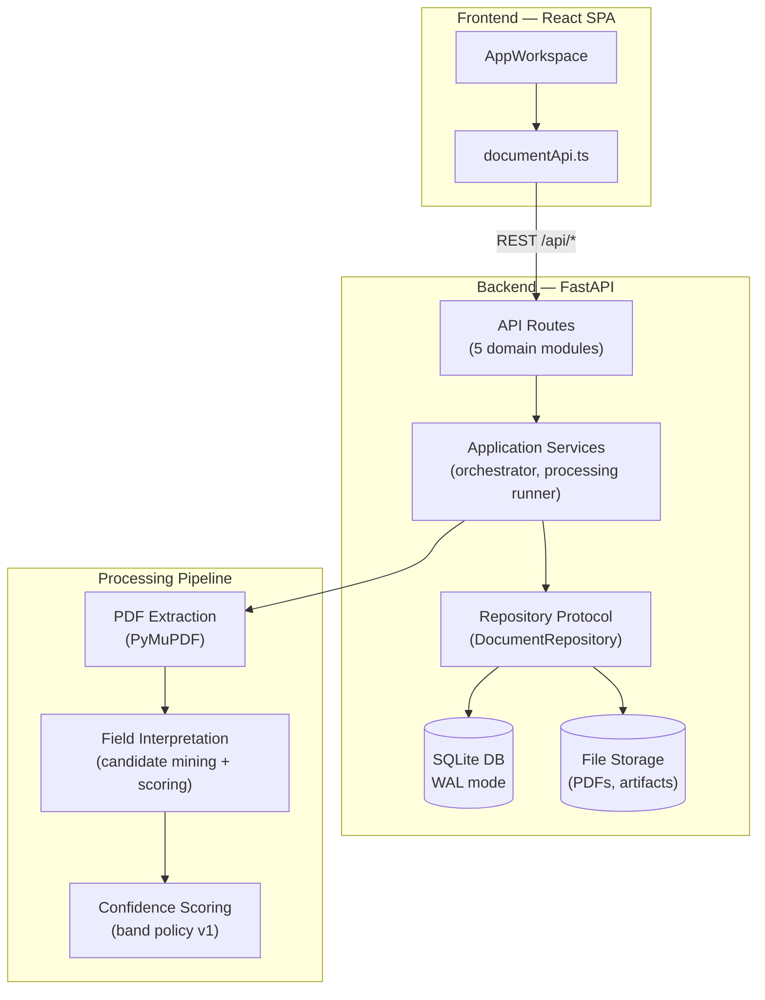

# Architecture Overview

> One-page summary for evaluators. For full detail, see [technical-design.md](technical-design.md).

## Tech stack

| Layer | Technology | Why |
|-------|-----------|-----|
| Frontend | React 18 + TypeScript 5 + Tailwind CSS 3 | Type-safe SPA with utility-first styling |
| Backend | Python 3.11 + FastAPI 0.115 | Async-first framework, auto-generated OpenAPI |
| Database | SQLite (WAL mode) | Zero-config, ACID, portable — see [ADR-ARCH-0002](adr/ADR-ARCH-0002-sqlite-database.md) |
| PDF parsing | PyMuPDF 1.24 | High-fidelity text extraction with built-in fallback |
| Unit testing | Vitest 4 + Pytest | Fast, parallel test runners for both stacks |
| E2E testing | Playwright 1.58 | Cross-browser automation with trace/video on failure |
| CI/CD | GitHub Actions (10 jobs) | Path-filtered, cached, cancel-in-progress |
| Containers | Docker Compose | One-command `docker compose up --build` |

## System diagram



## Key architectural decisions

| Decision | Rationale | Record |
|----------|-----------|--------|
| Modular monolith | Single deploy, clear boundaries, Docker-first | [ADR-ARCH-0001](adr/ADR-ARCH-0001-modular-monolith.md) |
| SQLite as primary DB | Zero-config, ACID, portable; PostgreSQL migration path documented | [ADR-ARCH-0002](adr/ADR-ARCH-0002-sqlite-database.md) |
| Raw SQL + repository pattern | Explicit queries, no ORM abstraction leaks | [ADR-ARCH-0003](adr/ADR-ARCH-0003-raw-sql-repository-pattern.md) |
| In-process async processing | No external queue for MVP; worker profile path documented | [ADR-ARCH-0004](adr/ADR-ARCH-0004-in-process-async-processing.md) |

## Data flow

1. **Upload** → PDF stored on disk, metadata in SQLite, processing queued in-process
2. **Extract** → Text extraction via PyMuPDF with built-in fallback for edge cases
3. **Interpret** → Field identification via regex + candidate mining + confidence scoring
4. **Review** → Evaluator sees structured fields with confidence indicators, can edit/approve/reprocess

## Project structure

```
backend/app/
├── api/           → 5 route modules (documents, review, processing, calibration, health)
├── application/   → orchestrator, processing runner, document services, extraction observability
│   └── processing/→ PDF extraction, interpretation, confidence scoring
├── domain/        → entities (models.py), status derivation
├── infra/         → SQLite repos (3 aggregates + façade), file storage
└── ports/         → repository protocols, file storage interface

frontend/src/
├── api/           → documentApi client
├── components/    → workspace/, viewer/, review/, structured/, ui/, app/, toast/
├── constants/     → shared constants
├── extraction/    → candidateSuggestions, fieldValidators
├── hooks/         → 8 custom hooks (upload, editing, sidebar, filters, split-panel, rawTextActions, reviewedEditBlocker, sourcePanelState)
├── lib/           → utils, filters, validators
└── types/         → shared TypeScript interfaces
```

## Quality metrics (post-Iteration 12)

| Metric | Value |
|--------|-------|
| Backend tests | ~395 (≥91% coverage) |
| Frontend tests | ~287 (≥87% coverage) |
| E2E specs | 64 (21 spec files) |
| CI jobs | 10 (path-filtered, ~4 min) |
| Lint errors | 0 |

## Related documentation

- [technical-design.md](technical-design.md) — Full architecture, contracts, state machines (~2K lines)
- [product-design.md](product-design.md) — Product intent and semantics
- [ux-design.md](ux-design.md) — Interaction contract and confidence UX rules
- [delivery-summary.md](refactor/delivery-summary.md) — Quantitative delivery evidence
- [ADR index](adr/README.md) — All architecture decision records
