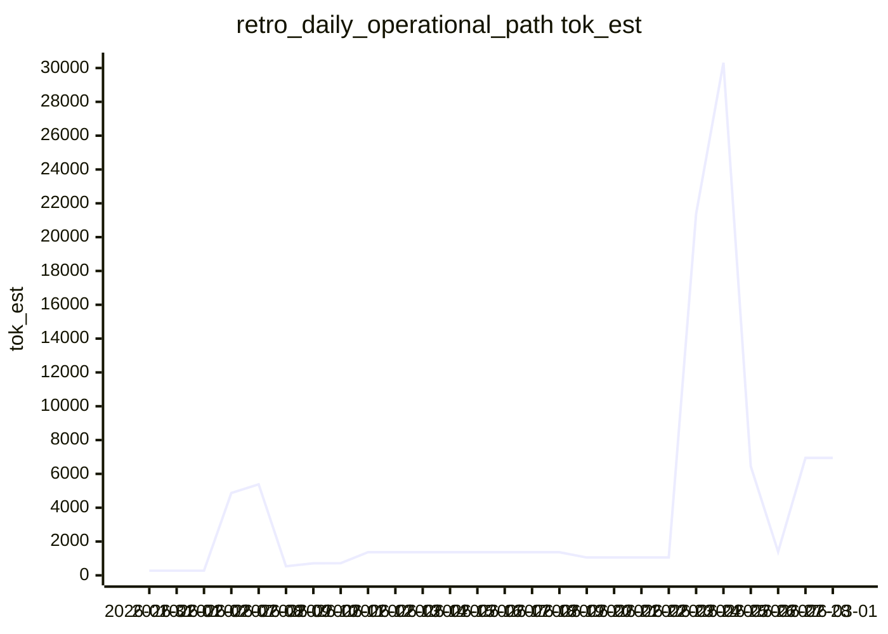
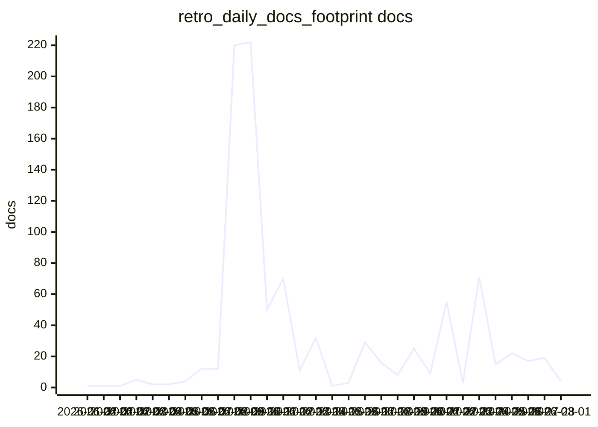
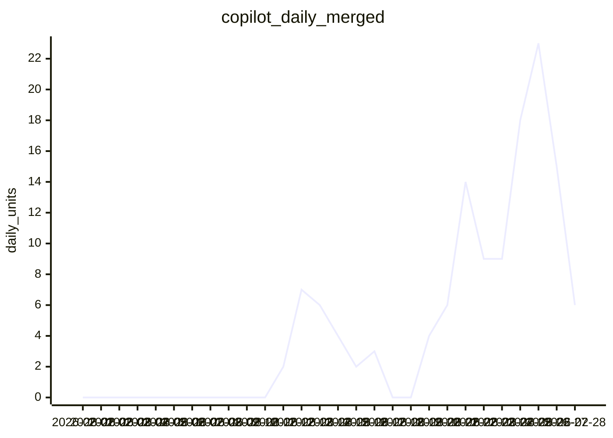
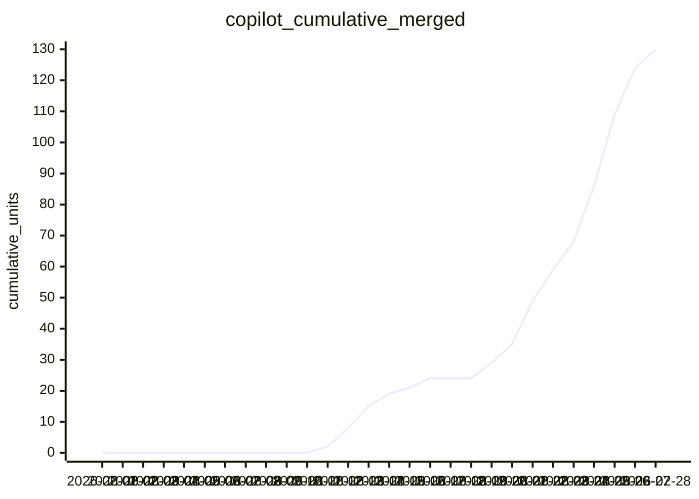

# LLM Benchmarks — Summary

| Scenario | Runs | Median docs | Median tok_est | Max max_doc_chars |
|---|---:|---:|---:|---:|
| retro_daily_docs_footprint | 30 | 12 | 40149 | 120554 |
| retro_daily_operational_path | 26 | 3 | 1367 | 115401 |
| retro_daily_snapshot | 26 | 4 | 21154 | 72007 |
| start_new_work | 1 | 2 | 7462 | 26313 |

## Visual trends

### Operational path — tok_est by day

### Docs footprint — docs count by day

## Real exported usage (multi-account)

Source: `metrics/llm_benchmarks/account_usage_merged_daily.csv` generated from account exports in `tmp/usage/`.

### Copilot daily units (merged)

### Copilot cumulative units (merged)

## Retro daily snapshot detail

| Date (UTC) | tok_est | chars_read | docs | commit |
|---|---:|---:|---:|---|
| 2026-01-31 | 276 | 1106 | 1 | 0c41281 |
| 2026-02-01 | 276 | 1106 | 1 | 5473f13 |
| 2026-02-02 | 276 | 1106 | 1 | e350329 |
| 2026-02-07 | 16858 | 67433 | 3 | 9c8fdb0 |
| 2026-02-08 | 17092 | 68368 | 3 | 0a754aa |
| 2026-02-09 | 18591 | 74363 | 4 | 8272183 |
| 2026-02-10 | 18798 | 75191 | 4 | 60cb2cd |
| 2026-02-11 | 19655 | 78620 | 4 | 2acfa84 |
| 2026-02-12 | 20488 | 81954 | 4 | 579254d |
| 2026-02-13 | 20526 | 82105 | 4 | 01a3ee6 |
| 2026-02-14 | 20526 | 82105 | 4 | 1e74304 |
| 2026-02-15 | 20526 | 82105 | 4 | 4ed9c3b |
| 2026-02-16 | 20526 | 82105 | 4 | 96a87f3 |
| 2026-02-17 | 21783 | 87131 | 4 | c1f712a |
| 2026-02-18 | 21869 | 87476 | 4 | 98bd43f |
| 2026-02-19 | 22142 | 88570 | 4 | 7e11b02 |
| 2026-02-20 | 24207 | 96828 | 4 | b4347b1 |
| 2026-02-21 | 24443 | 97773 | 4 | 23788a2 |
| 2026-02-22 | 24602 | 98406 | 4 | 5b94173 |
| 2026-02-23 | 24602 | 98406 | 4 | d7f1e30 |
| 2026-02-24 | 25355 | 101419 | 4 | 89e4dfd |
| 2026-02-25 | 26346 | 105382 | 4 | 42a87a2 |
| 2026-02-26 | 26352 | 105410 | 4 | 13e2e30 |
| 2026-02-27 | 26919 | 107677 | 4 | c8cd865 |
| 2026-02-28 | 26919 | 107677 | 4 | b9272b5 |
| 2026-03-01 | 26919 | 107677 | 4 | affd762 |

## Retro daily operational path detail

| Date (UTC) | tok_est | chars_read | docs | commit |
|---|---:|---:|---:|---|
| 2026-01-31 | 276 | 1106 | 1 | 0c41281 |
| 2026-02-01 | 276 | 1106 | 1 | 5473f13 |
| 2026-02-02 | 276 | 1106 | 1 | e350329 |
| 2026-02-07 | 4872 | 19487 | 2 | 9c8fdb0 |
| 2026-02-08 | 5382 | 21529 | 2 | 0a754aa |
| 2026-02-09 | 536 | 2143 | 3 | 8272183 |
| 2026-02-10 | 713 | 2853 | 3 | 60cb2cd |
| 2026-02-11 | 721 | 2884 | 3 | 2acfa84 |
| 2026-02-12 | 1367 | 5467 | 3 | 579254d |
| 2026-02-13 | 1367 | 5467 | 3 | 01a3ee6 |
| 2026-02-14 | 1367 | 5467 | 3 | 1e74304 |
| 2026-02-15 | 1367 | 5467 | 3 | 4ed9c3b |
| 2026-02-16 | 1367 | 5467 | 3 | 96a87f3 |
| 2026-02-17 | 1367 | 5467 | 3 | c1f712a |
| 2026-02-18 | 1367 | 5467 | 3 | 98bd43f |
| 2026-02-19 | 1367 | 5467 | 3 | 7e11b02 |
| 2026-02-20 | 1056 | 4224 | 3 | b4347b1 |
| 2026-02-21 | 1056 | 4224 | 3 | 23788a2 |
| 2026-02-22 | 1056 | 4224 | 3 | 5b94173 |
| 2026-02-23 | 1056 | 4224 | 3 | d7f1e30 |
| 2026-02-24 | 21375 | 85499 | 4 | 89e4dfd |
| 2026-02-25 | 30316 | 121264 | 4 | 42a87a2 |
| 2026-02-26 | 6446 | 25785 | 4 | 13e2e30 |
| 2026-02-27 | 1397 | 5587 | 3 | c8cd865 |
| 2026-02-28 | 6942 | 27766 | 4 | b9272b5 |
| 2026-03-01 | 6942 | 27766 | 4 | f163721 |

## Retro daily docs footprint detail

| Date (UTC) | tok_est | chars_read | docs | commit |
|---|---:|---:|---:|---|
| 2026-01-31 | 276 | 1106 | 1 | 0c41281 |
| 2026-02-01 | 276 | 1106 | 1 | 5473f13 |
| 2026-02-02 | 276 | 1106 | 1 | e350329 |
| 2026-02-03 | 11778 | 47113 | 5 | 5e64a30 |
| 2026-02-04 | 2839 | 11356 | 2 | 2170a0e |
| 2026-02-05 | 7440 | 29760 | 2 | 05471fb |
| 2026-02-06 | 40648 | 162590 | 4 | e032105 |
| 2026-02-07 | 34870 | 139481 | 12 | 9c8fdb0 |
| 2026-02-08 | 36631 | 146525 | 12 | 0a754aa |
| 2026-02-09 | 61496 | 245983 | 220 | 8272183 |
| 2026-02-10 | 48303 | 193211 | 222 | 60cb2cd |
| 2026-02-11 | 39651 | 158605 | 50 | 2acfa84 |
| 2026-02-12 | 72161 | 288644 | 70 | 579254d |
| 2026-02-13 | 28864 | 115456 | 11 | 01a3ee6 |
| 2026-02-14 | 18246 | 72986 | 32 | 1e74304 |
| 2026-02-15 | 3494 | 13976 | 1 | 4ed9c3b |
| 2026-02-16 | 1367 | 5467 | 3 | 96a87f3 |
| 2026-02-17 | 70838 | 283351 | 29 | c1f712a |
| 2026-02-18 | 54580 | 218318 | 16 | 98bd43f |
| 2026-02-19 | 43134 | 172537 | 8 | 7e11b02 |
| 2026-02-20 | 73081 | 292323 | 25 | b4347b1 |
| 2026-02-21 | 54789 | 219157 | 9 | 23788a2 |
| 2026-02-22 | 93533 | 374133 | 55 | 5b94173 |
| 2026-02-23 | 1056 | 4224 | 3 | d7f1e30 |
| 2026-02-24 | 89762 | 359049 | 71 | 89e4dfd |
| 2026-02-25 | 62775 | 251101 | 15 | 42a87a2 |
| 2026-02-26 | 58385 | 233541 | 22 | 13e2e30 |
| 2026-02-27 | 77075 | 308299 | 17 | c8cd865 |
| 2026-02-28 | 65607 | 262429 | 19 | b9272b5 |
| 2026-03-01 | 6942 | 27766 | 4 | 76b2fb3 |

