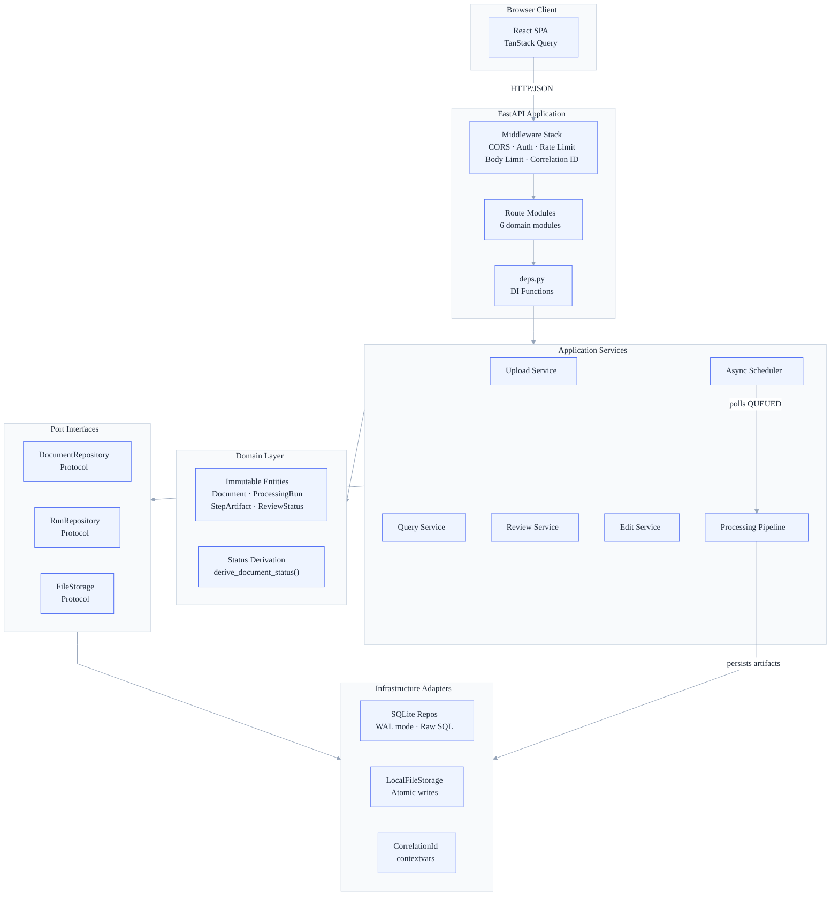
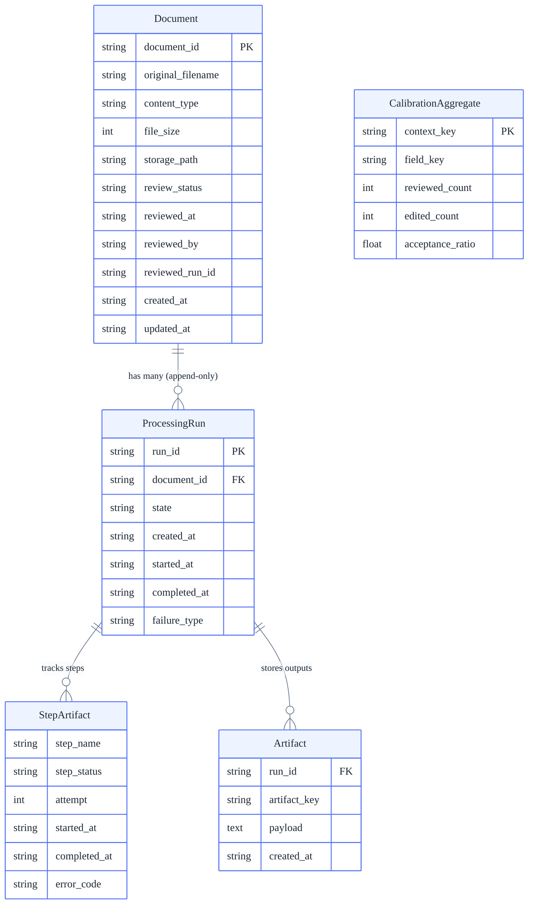
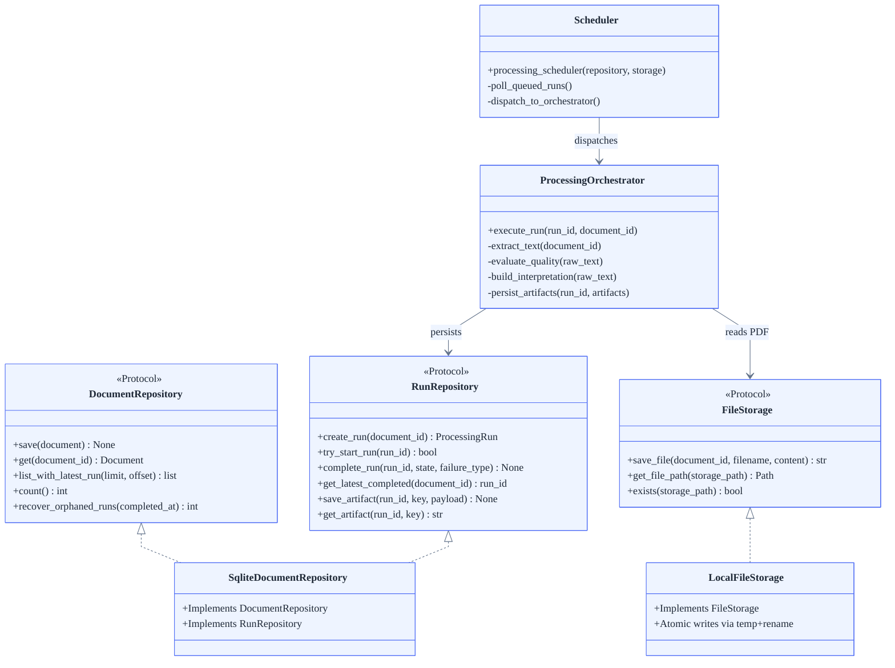
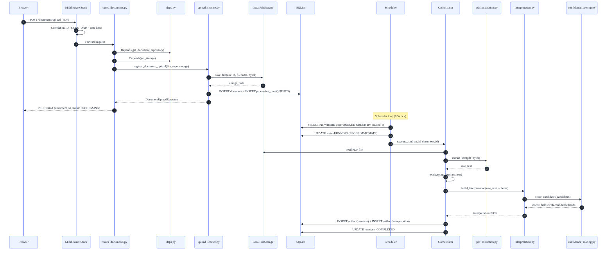
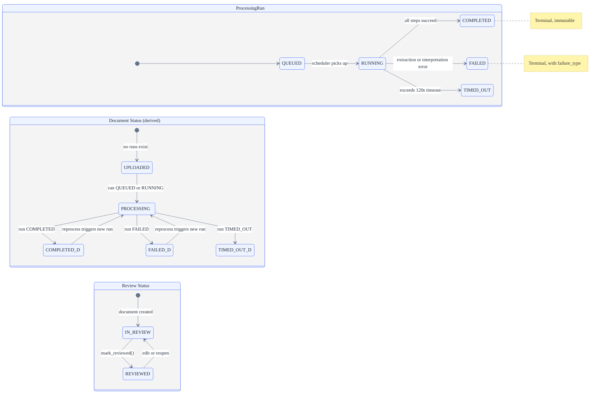
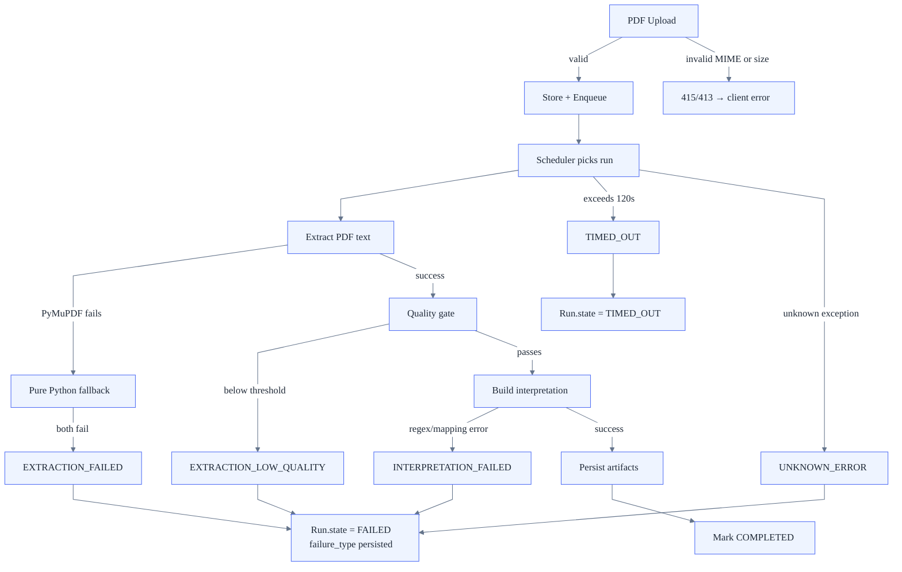

# Staff Engineer Guide — Evaluator Edition

> **Audience**: Staff/principal engineers evaluating this codebase.
> **Reading time**: ~45 minutes.
> **Repository**: [veterinary-medical-records-handoff](https://github.com/isilionisilme/veterinary-medical-records-handoff) (Python 3.11 + TypeScript)

---

## 1. Executive Summary

This is a **veterinary medical records processing system** that extracts structured clinical data from PDF documents, assigns confidence scores to each field, and presents a side-by-side review interface where veterinarians correct and validate the extraction. The system owns the full lifecycle — from PDF upload through text extraction, candidate mining, confidence scoring, and human review — and delegates nothing to external services. There is no LLM: extraction and interpretation use deterministic regex-based pipelines with a calibration feedback loop.

The architecture is a **modular monolith** with hexagonal boundaries (ports & adapters), an in-process async scheduler, SQLite persistence, and a React/TanStack Query frontend. Every architectural choice — SQLite over PostgreSQL, in-process over Celery, raw SQL over ORM, bootstrap DDL over migrations — is captured in an ADR with explicit rationale and trade-off analysis.

---

## 2. The Core Architectural Insight

The most important concept in this system is that **confidence is not accuracy — it is operational consistency across similar contexts over time**.

A field with 0.85 confidence does not mean "85% chance of being correct." It means: "in documents with similar characteristics (type, language, clinic), this field has been consistently interpreted the same way."

```go
// Pseudocode (Go) — confidence is composed, not predicted
func computeFieldConfidence(candidate CandidateScore, calibration CalibrationAdjustment) float64 {
    base := candidate.PatternMatchScore  // how well regex matched
    adjustment := calibration.Delta       // bounded [-0.2, +0.2] from review history
    return clamp(base + adjustment, 0.0, 1.0)
}
```

This design choice — deterministic composition over ML prediction — means:
- Confidence is **reproducible**: same input → same score, always
- Confidence is **explainable**: tooltip breaks down candidate_confidence + review_adjustment
- Confidence **never blocks**: it guides attention, never prevents user action
- The system can evolve to ML-based scoring by replacing one module behind the port interface

<!-- Sources: backend/app/application/processing/confidence_scoring.py, backend/app/application/confidence_calibration.py, wiki/projects/01-product/product-design.md §6 -->

---

## 3. System Architecture



**Heart of the system**: The `application/` layer — specifically the processing pipeline (`orchestrator.py` → `candidate_mining.py` → `confidence_scoring.py`) and the review lifecycle (`review_service.py` → `edit_service.py` → `calibration.py`). These embody the core product insight: extraction + confidence + correction feedback loop.

<!-- Sources: backend/app/main.py (create_app), backend/app/ports/, backend/app/infra/, backend/app/application/ -->

---

## 4. Domain Model



<!-- Sources: backend/app/domain/models.py, backend/app/infra/database.py (CREATE TABLE statements) -->

### Data Invariants

| Entity | Invariant | Enforced By |
|--------|-----------|-------------|
| Document | Never deleted, only soft-state changes | No DELETE endpoint; repo has no `delete()` method |
| ProcessingRun | Append-only; terminal states (COMPLETED, FAILED, TIMED_OUT) immutable | `complete_run()` guards state transition with `WHERE state = 'RUNNING'` |
| ProcessingRun | At most 1 RUNNING per document | `BEGIN IMMEDIATE` + `WHERE state IN ('QUEUED','RUNNING')` check |
| Artifact | Immutable after creation | INSERT-only; no UPDATE path |
| ReviewStatus | IN_REVIEW → REVIEWED (via mark); REVIEWED → IN_REVIEW (via edit or reopen) | `review_service.py` and `edit_service.py` enforce allowed transitions |
| CalibrationAggregate | Prospective only — calibration signals cannot retroactively change past interpretations | `calibration.py` updates aggregates, never rewrites artifact history |

---

## 5. Key Abstractions and Interfaces



**Load-bearing abstractions**: The `DocumentRepository` and `FileStorage` protocols are the seams that make the hexagonal architecture real. Application services depend only on these protocols — the SQLite and local filesystem implementations can be swapped for PostgreSQL/S3 by implementing the same interface.

<!-- Sources: backend/app/ports/document_repository.py, backend/app/ports/file_storage.py, backend/app/ports/run_repository.py, backend/app/infra/sqlite_document_repository.py, backend/app/infra/file_storage.py -->

---

## 6. Request Lifecycle



<!-- Sources: backend/app/api/routes_documents.py, backend/app/application/documents/upload_service.py, backend/app/application/processing/orchestrator.py, backend/app/application/processing/scheduler.py -->

---

## 7. State Transitions



**Key design choice**: Document status is **derived** from the latest run state, never stored directly. This eliminates status synchronization bugs — there is exactly one source of truth.

Review status is **independent** of processing status. A document can be REVIEWED even if a reprocess is triggered — the review state tracks the human judgment, not the machine state.

<!-- Sources: backend/app/domain/models.py, backend/app/domain/status.py (derive_document_status), backend/app/application/documents/review_service.py -->

---

## 8. Decision Log

| # | Decision | Alternatives Considered | Rationale |
|---|----------|------------------------|-----------|
| 1 | **Modular monolith** (hexagonal) | Microservices, layered monolith | Single deployable keeps ops minimal for small team; ports give clean seams for future extraction |
| 2 | **SQLite** as primary store | PostgreSQL, DynamoDB | Zero external infra; single file; sufficient for single-clinic scope; migration path exists via repository port |
| 3 | **In-process async scheduler** | Celery + Redis, RQ, external queue | Zero-ops; shared lifecycle with FastAPI; DB-backed queue provides at-least-once; throughput limited but acceptable for MVP |
| 4 | **Raw SQL** (no ORM) | SQLAlchemy, Tortoise ORM | Full control of SQLite guards (BEGIN IMMEDIATE, CONFLICT clauses); natural mapping to immutable domain models |
| 5 | **React + TanStack Query + Vite** | Next.js, Vue, fetch+useState | Fast HMR; declarative cache/invalidation; strong TS ergonomics; no SSR needed for SPA |
| 6 | **Deterministic confidence scoring** | ML classifier, statistical model | Transparent formula; bounded [0,1]; easy to test; supports calibration without ML infra |
| 7 | **Bootstrap DDL** (no migrations) | Alembic, Django migrations | Idempotent via IF NOT EXISTS; zero-config for evaluator; Alembic can be added behind port |
| 8 | **CI complexity gates** (changed files only) | Full-repo enforcement, no gates | Prevents new regressions without freezing delivery on historical hotspots |
| 9 | **Dual-mode PDF extraction** | PyMuPDF only, Tesseract OCR | Pure-Python fallback ensures portability; PyMuPDF for production performance |
| 10 | **Structured logging** (no Prometheus) | structlog, Prometheus+Grafana | Readable in `docker compose logs` without tools; structured fields ready for JSON migration |
| 11 | **Single Python 3.11 CI** | Multi-version matrix | Matches Docker runtime exactly; fast pipeline (~2 min) |

<!-- Sources: wiki/projects/02-tech/adr/ (11 ADR files) -->

---

## 9. Dependency Rationale

| Dependency | Purpose | What It Replaced/Avoided | Risk |
|------------|---------|--------------------------|------|
| **FastAPI** 0.135 | HTTP API framework | Flask, Django REST | Low — widely adopted, async-native |
| **Uvicorn** 0.41 | ASGI server | Gunicorn, Hypercorn | Low — standard FastAPI pairing |
| **Pydantic** 2.12 | Request/response validation | marshmallow, manual validation | Low — tight FastAPI integration |
| **PyMuPDF** 1.27 | PDF text extraction | pdfminer, Tesseract | Medium — C dependency; mitigated by pure-Python fallback |
| **slowapi** 0.1 | Rate limiting | Custom middleware, nginx rate limit | Low — thin wrapper on limits library |
| **python-json-logger** 4.0 | Structured log formatting | structlog, custom formatter | Low — minimal footprint |
| **TanStack Query** 5.51 | Server-state management | Redux, SWR, manual fetch | Low — declarative, cache-aware |
| **Radix UI** | Accessible primitives | shadcn (partial), custom | Low — headless, composable |
| **PDF.js** 4.10 | Browser PDF rendering | iframe embed, custom renderer | Low — Mozilla-maintained standard |
| **Playwright** | E2E testing | Cypress, Selenium | Low — modern, cross-browser, fast |
| **SQLite** (stdlib) | Persistence | PostgreSQL, MySQL | Deliberate constraint — zero-ops; port abstraction enables swap |

<!-- Sources: backend/requirements.txt, frontend/package.json, pyproject.toml -->

---

## 10. Data Flow and State

### Processing Artifacts

| Artifact | Storage | Format | Created By | Consumed By |
|----------|---------|--------|------------|-------------|
| Original PDF | Filesystem `{doc_id}/original.pdf` | Binary | `upload_service.py` | `pdf_extraction.py`, download endpoint |
| Raw text | Filesystem `{doc_id}/runs/{run_id}/raw-text.txt` + DB artifact | Plain text | `orchestrator.py` | Raw text viewer, quality evaluation |
| Interpretation | DB artifact (JSON) | `visit-grouped-canonical` schema | `interpretation.py` | Review UI, edit service |
| Step status | DB artifact (JSON) | `{step_name, step_status, timing}` | `orchestrator.py` | Processing history view |
| Calibration | DB `calibration_aggregates` | Aggregate counters | `calibration.py` | `confidence_scoring.py` |

### Storage Comparison

| Concern | SQLite | Filesystem | Why Split |
|---------|--------|------------|-----------|
| Document metadata | ✓ | | Relational queries, status derivation |
| Run lifecycle | ✓ | | Transactional state transitions |
| Interpretation JSON | ✓ | | Atomic updates, version history |
| Original PDF | | ✓ | Binary blobs don't belong in SQLite |
| Raw text artifact | Both | ✓ | Filesystem for streaming; DB for quick access |
| Calibration aggregates | ✓ | | Aggregate queries |

---

## 11. Failure Modes and Error Handling



**Recovery mechanisms**:
- **Orphaned run recovery**: On startup, any runs left in RUNNING state (from a crash) are marked FAILED
- **Reprocessing**: Users can trigger a new run at any time — runs are append-only, never mutated
- **Rate limiting**: Upload (10/min) and download (30/min) limits prevent resource exhaustion
- **Body size limit**: Non-upload POSTs capped at 1 MB via middleware
- **Graceful shutdown**: SIGTERM handler coordinates scheduler stop with 30s grace period

<!-- Sources: backend/app/application/processing/orchestrator.py, backend/app/main.py (lifespan), backend/app/infra/scheduler_lifecycle.py -->

---

## 12. Performance Characteristics

| Operation | Target | Enforced | Bottleneck |
|-----------|--------|----------|------------|
| PDF extraction | <2s for typical veterinary docs | Benchmark tests | PyMuPDF (C library); fallback is 3-5x slower |
| Full processing pipeline | <5s per document | 120s timeout | Interpretation step (regex matching across full text) |
| API response (non-processing) | P95 <500ms | Latency benchmarks in CI | SQLite read (WAL mode, no contention) |
| Document list | <200ms for 100 documents | Benchmark test | Single SQL query with JOIN + derived status |
| Upload throughput | 10/min per client | slowapi rate limiter | File I/O (atomic write) |

**Scaling limits**:
- SQLite single-writer: adequate for single-clinic; PostgreSQL adapter needed for multi-tenant
- In-process scheduler: single document at a time; worker pool separation needed for parallelism
- Local filesystem: works for single node; S3 adapter needed for distributed deployment

**These are deliberate constraints**, not oversights — each has an explicit migration path via the port abstraction.

---

## 13. Security Model

| Layer | Mechanism | Current State | Production Path |
|-------|-----------|--------------|-----------------|
| **Authentication** | Optional bearer token (`AUTH_TOKEN` env var) | MVP — sufficient for demo/evaluation | OAuth 2.0/JWT; RBAC per user |
| **Authorization** | None (single-user assumed) | MVP — all endpoints accessible | Role-based access control (vet vs. reviewer) |
| **Rate limiting** | slowapi: 10/min upload, 30/min download | Active | Per-user quotas |
| **Input validation** | PDF-only MIME check, 20 MB upload limit, UUID path params | Active, prevents path traversal | Content scanning |
| **Body limits** | 1 MB for non-upload POSTs | Active (custom middleware) | WAF |
| **Transport** | HSTS header set; TLS assumed at reverse proxy | Header active | TLS termination at load balancer |
| **Security headers** | X-Frame-Options: DENY, CSP: default-src 'self', X-Content-Type-Options: nosniff | Active | CSP refinement per deployment |
| **Dependency audit** | pip-audit + npm audit in CI | Active | Automated CVE alerts |
| **Correlation** | X-Request-ID on every response (contextvars) | Active | Audit logging per user |

**Trust boundary**: The API trusts nothing from the client. File content is validated (MIME + size), path parameters are UUID-validated, and all error responses use a consistent envelope (`{error_code, message, details}`).

<!-- Sources: backend/app/main.py (_apply_security_headers, auth middleware), backend/app/infra/rate_limiter.py, backend/app/api/routes_documents.py (upload validation) -->

---

## 14. Testing Strategy

| Layer | Tool | Count | What It Covers |
|-------|------|-------|----------------|
| **Backend unit** | pytest | ~758 tests | Domain logic, services, repos, extractors, validators, confidence scoring |
| **Backend integration** | pytest | included above | Full-stack scenarios: upload → process → review → edit |
| **Backend benchmarks** | pytest-benchmark | ~10 | Latency baselines: extraction, interpretation, API endpoints |
| **Frontend unit** | Vitest | ~356 tests | Hooks, validators, components, API layer |
| **Frontend E2E** | Playwright | 65 tests / 21 specs | Full user workflows: upload, review, edit, search, accessibility |
| **Accessibility** | @axe-core/playwright | included in E2E | WCAG 2.1 AA — 0 critical violations enforced |
| **CI quality gates** | Custom scripts | per-commit | CC ≤ 20 (warn ≥11, fail >30), LOC ≤ 500, changed files only |
| **Dependency audit** | pip-audit + npm audit | per-commit | CVE scanning |

**Coverage thresholds**: Backend 85% (pytest), Frontend 80% lines/functions/statements, 70% branches (Vitest).

**Testing philosophy**: Tests verify behavior, not implementation. Backend tests use in-memory SQLite and temp directories. Frontend tests mock the API layer and verify user interactions. E2E tests run against the real Docker stack.

**What is NOT tested**: No load/stress tests (out of scope for MVP). No chaos engineering. No mutation testing.

<!-- Sources: pytest.ini, frontend/vite.config.ts (coverage thresholds), frontend/e2e/ (21 spec files), backend/tests/ -->

---

## 15. Known Technical Debt

| # | Issue | Risk | Affected Area | Mitigation/Path |
|---|-------|------|--------------|-----------------|
| 1 | **AppWorkspace.tsx ~2,200 LOC** | Medium | Frontend | 28 hooks + 3 panels already extracted (-62%); remaining is render orchestration; further extraction diminishes returns |
| 2 | **Single-process scheduler** | Medium | Backend | In-process design is deliberate (ADR); worker profile separation when throughput demands it |
| 3 | **SQLite single-writer** | Low (MVP) | Backend | WAL mode + busy timeout; PostgreSQL adapter via port interface when multi-tenant needed |
| 4 | **No DB migrations** | Low | Backend | Bootstrap DDL is idempotent; Alembic can be added behind port when schema evolution required |
| 5 | **Regex-based extraction** | Medium | Processing | Works for structured veterinary PDFs; ML-based extraction is a roadmap item, pluggable via same orchestrator interface |
| 6 | **Minimal auth boundary** | High (production) | API | Deliberate for MVP; hexagonal arch allows adding OAuth/RBAC without modifying domain/app layers |
| 7 | **No CDC/event bus** | Low | Architecture | Append-only runs + artifacts provide audit trail; event sourcing possible if needed |

---

## 16. Where to Go Deep

### Recommended Reading Order

**If you have 15 minutes** — understand the product and architecture:
1. [Product Design](../projects/01-product/product-design.md) — §1–4 (Problem, Goal, Principles)
2. [Technical Design](../projects/02-tech/technical-design.md) — §1–2 (Domain Model, Pipeline)

**If you have 30 minutes** — add the "why" behind every decision:
3. [ADR: Modular Monolith](../projects/02-tech/adr/ADR-modular-monolith.md) — hexagonal boundaries
4. [ADR: SQLite Database](../projects/02-tech/adr/ADR-sqlite-database.md) — zero-ops persistence
5. [ADR: In-Process Async](../projects/02-tech/adr/ADR-in-process-async-processing.md) — scheduler design
6. [ADR: Confidence Scoring](../projects/02-tech/adr/ADR-confidence-scoring-algorithm.md) — deterministic composition

**If you have 45 minutes** — trace the code:
7. `backend/app/main.py` — composition root (lines 1–120: wiring)
8. `backend/app/application/processing/orchestrator.py` — the pipeline heart
9. `backend/app/application/processing/confidence_scoring.py` — confidence formula
10. `backend/app/domain/models.py` + `backend/app/domain/status.py` — immutable entities + derived states
11. `frontend/src/context/WorkspaceContext.tsx` — hook composition pattern

**Cross-cutting concerns**:
- [Implementation Plan](../projects/04-delivery/implementation-plan.md) — release sequencing and incremental delivery
- [UX Design](../projects/01-product/specs/ux-design.md) — interaction contract
- [Quality Audit History](../projects/04-delivery/quality-audit-history.md) — architecture quality evolution

### Run It Yourself

```bash
# Clone and start (Docker required)
git clone https://github.com/isilionisilme/veterinary-medical-records-handoff.git
cd veterinary-medical-records-handoff
docker compose up --build

# Frontend: http://localhost:5173
# Backend:  http://localhost:8000
# Health:   http://localhost:8000/health/ready

# Run all backend tests
docker compose run --rm backend-tests

# Run all frontend tests
docker compose run --rm frontend-tests
```

---

## Appendix: Concept Mapping for Non-Python Engineers

| Python / This Codebase | TypeScript/JS Equivalent | Go Equivalent |
|------------------------|-------------------------|---------------|
| `dataclass(frozen=True)` | `Readonly<T>` interface | `struct` (value types) |
| `Protocol` (typing) | `interface` | `interface` |
| `StrEnum` | `enum` (string) | `const` block with `type` alias |
| `asyncio.to_thread()` | `Worker` / thread pool | `go func()` goroutine |
| `contextvars` | `AsyncLocalStorage` | `context.Context` |
| `FastAPI Depends()` | Middleware / provider pattern | Wire / DI container |
| `BEGIN IMMEDIATE` (SQLite) | Serializable transaction | `db.BeginTx(ctx, &sql.TxOptions{...})` |
| `pytest fixtures` | `beforeEach` / factory functions | `testing.T` + test helpers |
| `TanStack Query` | SWR, Apollo Client | N/A (server frameworks differ) |
| Pydantic `BaseModel` | Zod schema + inferred type | `json` struct tags + validator |
